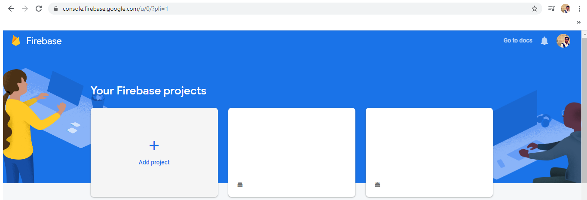
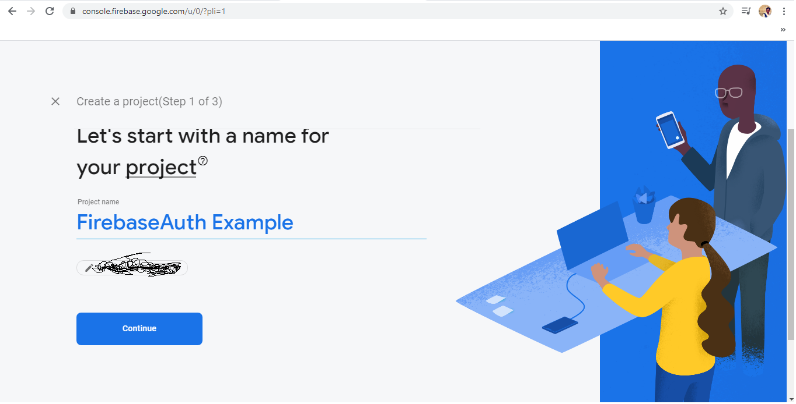
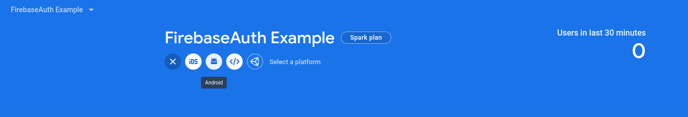
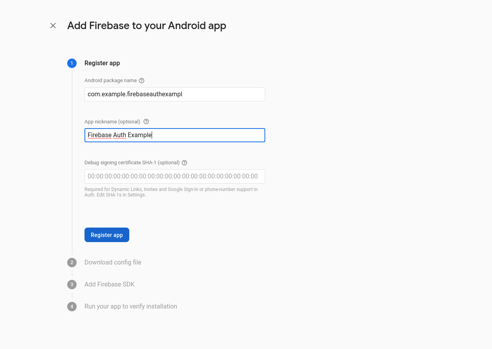
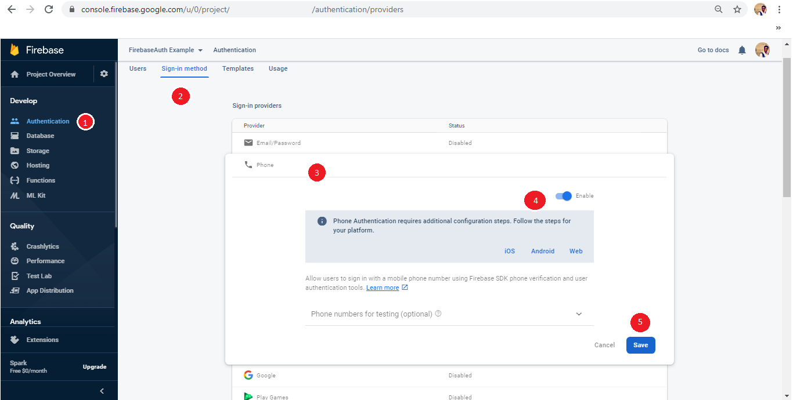
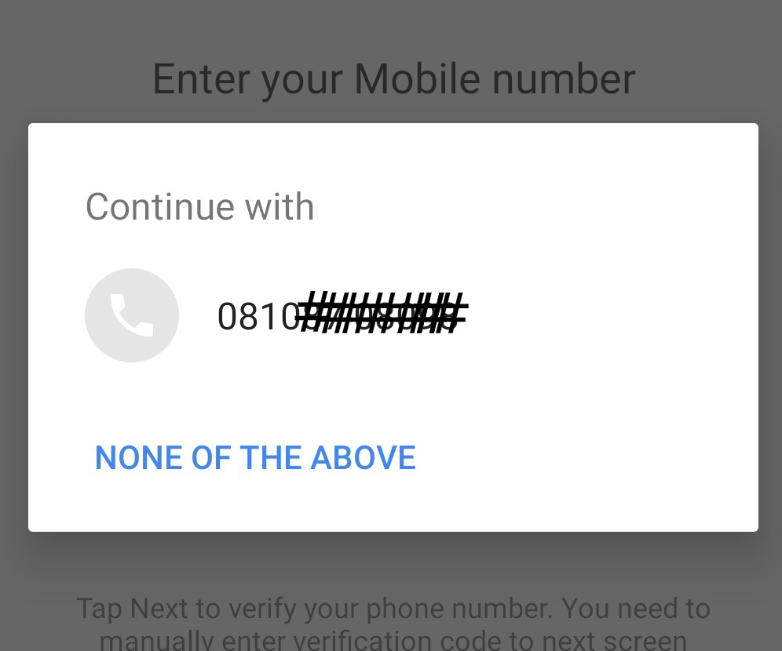

<h1 align="center">
  <br>
  <a href="https://firebase.google.com/products/auth/"></a>
</h1>
<h1 align="center">Firebase Authentication</h1>

### What is Firebase
Firebase is a mobile and web application development platform developed by Firebase, Inc. in 2011, then acquired by Google in 2014.As of October 2018, the Firebase platform has 18 products,which are used by 1.5 million apps.
Firebase's first product was the Firebase Real-time Database, an API that synchronizes application data across iOS, Android, and Web devices, and stores it on Firebase's cloud. The product assists software developers in building real-time, collaborative applications.

### Firebase Services
  1. [Firebase Realtime Database](https://firebase.google.com/products/realtime-database/)
  2. [Cloud Firestore](https://firebase.google.com/products/firestore/)
  3. [ML Kit](https://firebase.google.com/products/ml-kit/)
  4. [Cloud Function](https://firebase.google.com/products/functions/)
  5. [Firebase Authentication](https://firebase.google.com/products/auth/)
  6. [Firebase Cloud Storage](https://firebase.google.com/products/storage/)
  7. [Firebase Hosting](https://firebase.google.com/products/hosting/)
  8. [Firebase Analytics](https://firebase.google.com/products/analytics/)
  9. [Crashlytics](https://firebase.google.com/products/crashlytics/)
  10. [Performance Monitoring](https://firebase.google.com/products/performance/)
  11. [Firebase Test Lab](https://firebase.google.com/products/test-lab/)
  12. [App Distribution](https://firebase.google.com/products/app-distribution/)
  13. [Firebase Dynamic Links](https://firebase.google.com/products/dynamic-links/)
  14. [In-App Messaging](https://firebase.google.com/products/in-app-messaging/)
  15. [Predictions](https://firebase.google.com/products/predictions/)
  16. [A/B Testing](https://firebase.google.com/products/ab-testing/)
  17. [Firebase Cloud Messaging(FCM)](https://firebase.google.com/products/cloud-messaging/)
  18. [Remote Config](https://firebase.google.com/products/remote-config/)
  
 # In this repository we learn about Firebase Authentication.
 <p>Firebase Authentication provides backend services, easy-to-use SDKs, and ready-made UI libraries to authenticate users to your app. It supports authentication using passwords, phone numbers, popular federated identity providers like Google, Facebook and Twitter, and more.

Firebase Authentication integrates tightly with other Firebase services, and it leverages industry standards like OAuth 2.0 and OpenID Connect, so it can be easily integrated with your custom backend.</p>

### In this repository we learn about NINE diffrent authentication method.</p>
  1. OTP based Mobile Number Authentication.
  2. Google Account based Authentication
  3. Facebook Account based Authentication
  4. Twitter Account based Authentication
  5. Github Account based Authentication
  6. Yahoo Account based Authentication
  7. Email Account based Authentication
  8. MSLive Account based Authentication
  9. Play Games Account based Authentication

### Here is step to ADD Firebase and Firebase SDK to android project.
  1. Create one Android project in Android Studio. 
  2. Login to Firebase and goTo Firebase Console.
  <p ></p>
  
  3. Click on Add Project Button and create new Project.
  <p ></p>
 
  4. After Successfully project creation Click on Android ICON of Header for Project Registration for Android.
  <p ></p>
  
  4. Add Project ID or ApplicatiID or packageName of created application and register the app 
  <p ></p>
  
  5. Then download the google-services.json config File from the step and add copy the file and paste to your android project App level directory (Means project_directory/app/google-services.json).
  6. Add Firebase SDK and authentication dependencies.
  
```gradle
  build.gradle(Project Level)
  
  buildscript {
    repositories {
        google()
        jcenter()
        
    }
    dependencies {
        classpath 'com.android.tools.build:gradle:3.5.3'
        classpath 'com.google.gms:google-services:4.3.3'
    }
}

allprojects {
    repositories {
        google()
        jcenter()
    }
}
```

```gradle
  build.gradle(App Level)
  
dependencies {
    // Add the Firebase SDK for Google Analytics
    implementation 'com.google.firebase:firebase-analytics:17.2.1'                                  

    // Add Firebase Auth Dependencies
    implementation 'com.google.firebase:firebase-auth:19.2.0' 
}
apply plugin: 'com.google.gms.google-services'
```
7. We're Set to start diffrent authentication option.

## 1) Phone Number Authentication
First you need to **enable** the Phone Auth Provider in Firebase Console. 
<p ></p>

<p>
  
  For This kind of Contact hint you need to implement
  ```gradle
  build.gradle(App Level)
  
dependencies {
    // Google Auth Dependencies for Device Mobile N0. Popup
    implementation 'com.google.android.gms:play-services-auth:17.0.0' 
}
apply plugin: 'com.google.gms.google-services'
```


</p>

Phone Number Auth All code (Contact Hint, Request OTP, Verify OTP, Resend OTP) Writen in [MobileAuthActivity](https://github.com/deepakgupta7403/FirebaseAuth-Example/blob/master/app/src/main/java/com/example/firebaseauthexample/activity/MobileAuthActivity.java) Class
  
 ### Some Important links related Firebase
  1. [Products](https://firebase.google.com/products)
  2. [Use Cases](https://firebase.google.com/use-cases)
  3. [Pricing](https://firebase.google.com/pricing)
  4. [Docs](https://firebase.google.com/docs)
  5. [Support](https://firebase.google.com/support)
